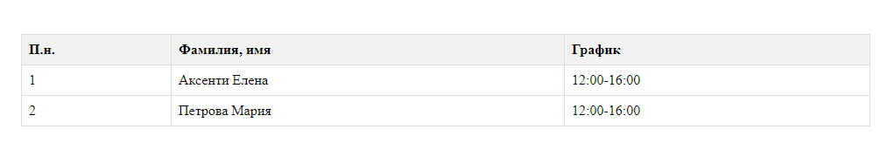

# Лабораторная №2

Этот репозиторий содержит проект на языке PHP, который вы можете запустить локально на своем компьютере.

## Инструкция по запуску проекта

1. **Клонируйте репозиторий**

   Сначала склонируйте репозиторий на свой компьютер с помощью команды:

    ```bash
    git clone https://github.com/CalinNicolai/Web-Programming-Lab-2.git
    ```
2. **Установите PHP и Composer**

   Убедитесь, что на вашем компьютере установлен PHP и Composer. Если их нет, вы можете скачать их с официальных веб-сайтов:

   - [Скачать PHP](https://www.php.net/downloads)

3. **Запустите веб-сервер**

   Запустите веб-сервер PHP в директории проекта:

    ```bash
    php -S localhost:8080
    ```

4. **Откройте проект в браузере**

   Откройте ваш любимый веб-браузер и перейдите по адресу 
   
   - [Lab2](https://localhost:8080)

   Теперь вы должны увидеть ваш проект в браузере.
## Описание проекта

В данной лабораторной работе была создана HTML-таблица, где в качестве значения колонки "График работы",
был подставлен вызов php-функции. Эта функция ориентируется на текущую дату и устанавливает соответствующий график
работы докторов.

## Краткая документация к проекту

#### Таблица, отображающая график работы докторов:

```html

<!DOCTYPE html>
<html lang="en">
<head>
    <meta charset="UTF-8">
    <meta name="viewport" content="width=device-width, initial-scale=1.0">
    <title>График работы докторов, каб. 333</title>
    <style>
        h2 {
            text-align: center;
            margin-bottom: 20vh;
        }
        table {
            border-collapse: collapse;
            width: 100vh;
            margin: 0 auto
        }

        th, td {
            border: 1px solid #dddddd;
            text-align: left;
            padding: 8px;
        }

        th {
            background-color: #f2f2f2;
        }
    </style>
</head>
<body>

<h2>График работы докторов, каб. 333</h2>

<table>
    <tr>
        <th>П.н.</th>
        <th>Фамилия, имя</th>
        <th>График</th>
    </tr>
   ```
   ```php
    <?php

    for ($i = 1; $i <= 2; $i++) {
        echo "<tr>";
        echo "<td>$i</td>";

        // Имя доктора (замените на реальные фамилии и имена)
        $doctorName = ($i == 1) ? "Аксенти Елена" : "Петрова Мария";
        echo "<td>$doctorName</td>";

        // График работы в зависимости от дня недели
        $currentDay = date('N');  // Получаем текущий день недели (1 - понедельник, 2 - вторник и так далее)

        if ($currentDay == 1 || $currentDay == 3 || $currentDay == 5) {
            // Понедельник, среда, пятница
            echo "<td>8:00-12:00</td>";
        } elseif ($currentDay == 2 || $currentDay == 4 || $currentDay == 6) {
            // Вторник, четверг, суббота
            echo "<td>12:00-16:00</td>";
        } else {
            // Воскресенье
            echo "<td>Нерабочий день</td>";
        }

        echo "</tr>";
    }
    ?>
   ```
   ```html
</table>

</body>
</html>
   ```
## 4. Пример использования проекта (с приложением скриншотов)


### Задание 1 `index.php`

1. Создайте файл `index.php` с указанным кодом.
   - *Проанализируйте скрипт и объясните его работу.*

2. Анализируйте скрипт и объясните его работу.
   - Этот скрипт создает две переменные `$nume` и `$prenume`, содержащие фамилию и имя соответственно. Затем он выводит текст, используя эти переменные, а также переменную `$varsta`, которая содержит возраст. Текст выводится в формате "Фамилия клиента [значение переменной $nume], а его имя [значение переменной $prenume]. Возраст клиента [значение переменной $varsta]."

3. Сохраните файл.

4. Запустите веб-сервер.

5. Используйте виртуальный адрес скрипта для интерпретации.

6. Проанализируйте результат.
   - Результатом выполнения скрипта будет текст, содержащий фамилию, имя и возраст клиента.

### Задание 2 `task2.php`

1. Добавьте указанный скрипт в файл `index.php`.

2. Сохраните и интерпретируйте скрипт.

3. Проанализируйте результат.
   - В зависимости от текущего дня недели скрипт выводит сообщение "Хороших вам выходной" или "Приятного рабочего дня вам!" если это пятница или другой день соответственно.

4. Замените `if...else` на тернарный оператор и объясните изменения.
   - Можно сказать что функционал не изменился, но код стал менее грамостким, но в то же время и менее читаемым.

5. Добавьте блок `elseif` вместо `if...else` и объясните изменения.
   - Это изменение добавляет обработку другого случая. Если в данным момент воскресенье, то выведется сообщение "Завтра начинается новая рабочая неделя!".
6. Сохраните и интерпретируйте скрипт.

7. Проанализируйте результат.
   - Результатом будет то же сообщение, но оно будет выводиться с использованием тернарного оператора и блока `elseif`.

8. Замените буквенный параметр дня недели на цифровой согласно документации PHP.
   - Чтобы изменить формат функции `date()`, нужно передать в нее строку 'w' таким образом будут возвращаться только числа от 0 до 6 где 0 - воскресение, 6 - суббота.
9. Сохраните и интерпретируйте скрипт.

10. Проанализируйте результат.
   - Результат будет аналогичен предыдущему, но с использованием цифрового параметра для дня недели.

11. Измените условие для обработки текущего дня недели и выведите соответствующее сообщение.
   - Скрипт будет адаптирован для вывода сообщения в зависимости от текущего дня недели.

### Задание 3 `operator.php`

1. Создайте файл `operator.php` с указанным кодом.

2. Проанализируйте скрипт и объясните его работу.
   - Этот скрипт определяет сообщение в зависимости от значения переменной `$varsta`. Если значение меньше 12 или больше 40, выводится соответствующее сообщение, в противном случае выводится сообщение о "рассвете сил". Затем выводится сообщение, содержащее имя и сообщение.

3. Сохраните файл и запустите скрипт.

4. Проанализируйте результат.
   - Результатом выполнения скрипта будет сообщение с соответствующим возрастом и именем.

5. Прокомментируйте строку, где устанавливается значение переменной `nume`.

6. Интерпретируйте скрипт. Что вы заметили?
   - Эта строка проверяет, имеет ли переменная `$nume` значение. Если оно есть, то выводится имя и сообщение, иначе выводится "Anonymous" и сообщение.

### Задание 4 `task4.php`

1. Используя `switch()` и функцию `date()`, проверьте текущий день недели и выведите на русском языке форматированный текст.

Дополни этот readme.md файл учитывая что есть еще одно задание

### Задание 5 `homework.php`

1. Создайте файл `homework.php` с указанным кодом.

 Используя функцию `date()` из PHP и HTML элементы для создания таблиц, создайте таблицу с следующим контентом:

| П.н. | Фамилия, имя  |  График |
|:-----|:-------------:|--------:|
| 1.   | Аксенти Елена | xx - xx |
| 2.   | Петрова Мария | yy - yy |
   
3. Вместо "8:00-12:00", выведите "8:00-12:00", если день недели - понедельник, среда или пятница. В противном случае выведите "Нерабочий день".
   Вместо "12:00-16:00", выведите "12:00-16:00", если день недели - вторник, четверг
